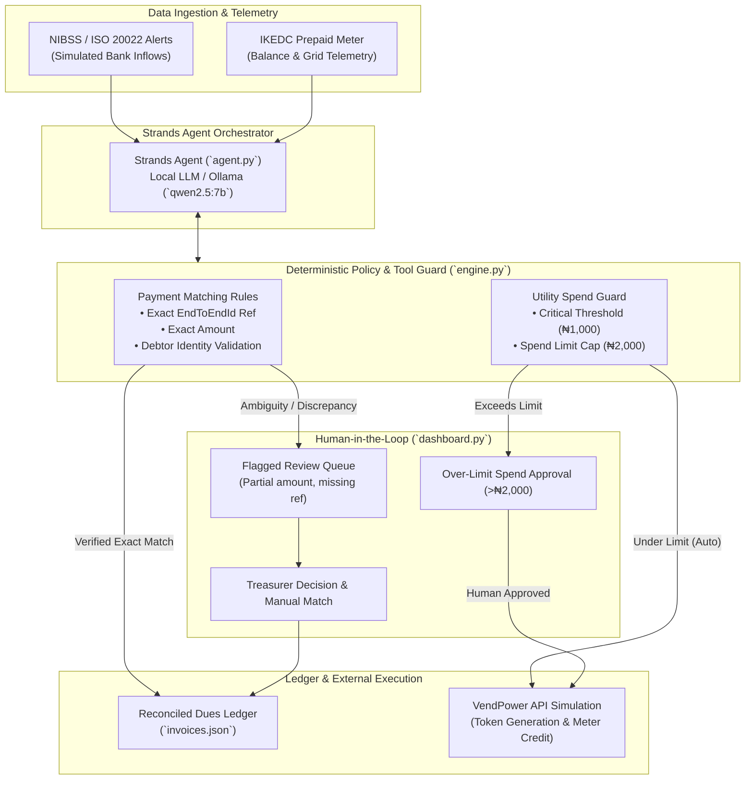

# EquiTrade Guardian

A Strands agent that takes two repetitive jobs off a small Nigerian nonprofit:
matching incoming transfers to member dues, and keeping the office prepaid
meter from running out.

Built for the AWS **Agents for Humans** hackathon (**Good Neighbor** track).

> **⚠️ SIMULATED DATA NOTICE**
> This project uses entirely fictional, mocked data modelled on Nigerian payment
> and utility systems for demonstration purposes.
> - **Payments** are formatted to resemble NIBSS / ISO 20022 messages but are
>   hard-coded JSON fixtures — no real NIBSS or bank API is called.
> - **Electricity top-ups** follow the structure of an IKEDC-style prepaid meter
>   and a VendPower-style API, but the "purchase" is simulated locally and the
>   token is randomly generated — no real IKEDC, IKEDC API, or VendPower API is
>   called.
> - Member names, invoice amounts, and meter readings are all fabricated.

## Who it is for

**Ikeja Community Cooperative** (demo org), a treasurer who otherwise spends
mornings copying NIBSS alerts into a spreadsheet, then walking to a vendor
to buy an electricity token when the lights flicker.

## What it does

1. **Reconcile payments.** Incoming transfers are shaped like ISO 20022 /
   NIBSS National Payment Stack messages (`EndToEndId`, debtor name, amount).
   The agent auto-matches only when all of these are true:
   - EndToEndId uniquely matches an open invoice reference
   - Amount is exact
   - Debtor name is compatible with the member name
2. **Stop when unsure.** Missing reference, amount mismatch, or unknown payer
   is never guessed. A human gets a concrete reason and decides.
3. **Top up prepaid power.** If the IKEDC meter is below threshold, the agent
   buys credit through a simulated VendPower API. Anything above the
   auto-approve limit requires an explicit yes.

The model **orchestrates and explains**. Matching rules and spend limits live
in Python tools, so a local 7B model cannot “hallucinate a match” or buy
power without policy.

## Architecture Diagram



## Demo data (on purpose)

Five payments:

| Payment | What happens |
|---|---|
| PAY-101 Amaka, exact ref + amount | Auto-reconciled |
| PAY-105 Ngozi, exact ref + amount | Auto-reconciled |
| PAY-102 `T. Bello`, no EndToEndId | Human review |
| PAY-103 Grace, ref matches, ₦500 short | Human review |
| PAY-104 Unknown Transfer, ₦5000, no ref | Human review |

Meter starts at ₦800; recommended top-up is ₦4000 vs a ₦2000 auto-approve
limit, so the agent must ask.

NIBSS and VendPower are **simulated** with realistic payloads so the demo
runs offline. Live bank/disco APIs are not public for a weekend build.

## Setup

1. Install [Ollama](https://ollama.com/download) and pull a tool-calling model:
   ```
   ollama pull qwen2.5:7b
   ```
2. Create a venv and install:
   ```
   python -m venv venv
   venv\Scripts\Activate.ps1
   pip install -r requirements.txt
   ```
3. Restore sample data, then run the agent (it will pause in the terminal):
   ```
   python reset_data.py
   python agent.py
   ```

Optional operations dashboard (no LLM; same policy engine):

```
python dashboard.py
```

Open http://127.0.0.1:5050 — apply matching, resolve exceptions, approve or
deny the meter top-up.

## Project structure

```
reconcile-agent/
├── agent.py          # Strands agent (Ollama + three tools)
├── tools.py          # Tool wrappers
├── engine.py         # Matching rules + VendPower simulation
├── dashboard.py      # Local live-demo UI
├── reset_data.py     # Restore fixtures
├── fixtures/         # Clean demo snapshots
└── data/             # Working copies (edited in place)
```

## Submission notes

- **Track:** Good Neighbor (Professional is a reasonable second label)
- **SDK:** Strands Agents, local Ollama for development
- **Safety:** human handoff is enforced in tools, not left to model manners
